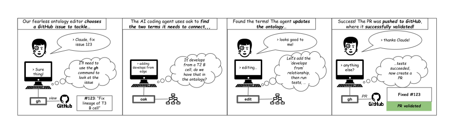
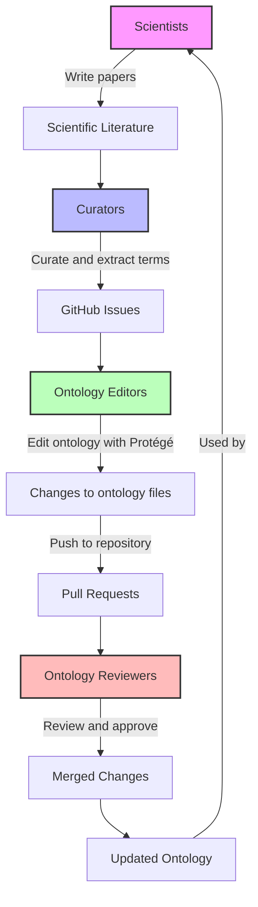

# ODK-AI: Coding Ontologies Using AI Tools

ODK-AI is a Docker container for running claude-code (and in future, similar tools) with ontologies.
It is designed to be executed either interactively or in "headless" mode.



For more details, see [this tutorial (in progress)](https://docs.google.com/presentation/d/1_ciRsRqs0hDtjcFBwZ9UhQhiQ3tlB_dOfQVEp5QR8LU/edit?slide=id.g24560ef6bb7_0_84#slide=id.g24560ef6bb7_0_84)

The container extends [ODK](https://github.com/INCATools/ontology-development-kit/), which means any tool available to ODK (e.g. ROBOT) is available for `claude-code` to use.

## Ontology Development is a Team Science with many "Agents"

Ontology development is typically a collaborative process involving multiple stakeholders. The diagram below illustrates the traditional workflow:



This team science approach involves multiple human "agents" with specialized roles working together to maintain and expand ontologies.

ODK-AI is designed to help with any piece of this that involves interacting with GitHub

## Features

- Built on ODK container with tools like ROBOT already installed
- Automatically initializes template files for your ontology project
- Supports both interactive and headless modes 
- Can create and manage pull requests
- GitHub CLI integration for issue tracking

## Quick Start

Get up and running with:

```bash
export PATH="$PATH:$HOME/repos/odk-ai/bin"
ANTHROPIC_API_KEY=$ANTHROPIC_API_KEY odkai.sh
```

See the [Getting Started](getting-started.md) guide for more details.

## Caveats

* Workflow is primarily tested with ontologies that keep their source in `.obo` format
* This project is in early development and may have bugs
